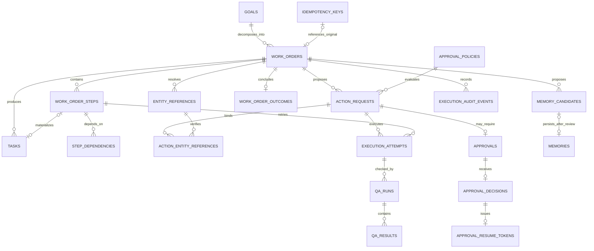
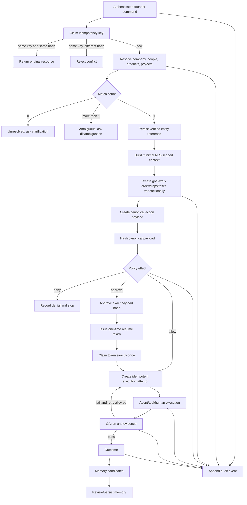

# SEM Brain v1 Phase 0 Architecture Review

Status: **Phase 0 review artifact - no production migration applied**
Branch: `codex/sem-brain-v1`
Date: 2026-08-24

## 1. Decision summary

SEM Brain v1 keeps the useful v0.7.1 domain tables and the authenticated Next.js
application. It does not import Blank Collar as a second operating database and does
not recreate existing goals, tasks, approvals, agents, memories, or work orders.

The target control loop is:

```text
Brain -> Orchestrator -> Context -> Policy -> Agents
      -> Work Orders -> QA -> Outcome -> Audit
```

The durable execution hierarchy is:

```text
GOAL -> WORK ORDER -> STEP/TASK -> EXECUTION -> QA -> OUTCOME
```

Blank Collar's strongest ideas retained in this design are goal-first work, explicit
allow/approve/deny policy evaluation, durable run state, role-scoped workers, bounded
tools, evidence-aware memory, and append-oriented audit. SEM Brain retains its
multi-company model, sensitive-table split, founder-first chat, revenue/operations
modules, bilingual UX, Supabase Auth/RLS, and existing production data.

## 2. Current architecture baseline

### Real today

- Next.js 16 application under `web/`.
- Supabase Auth route protection through `proxy.ts`.
- Caller-scoped Supabase clients using `@supabase/ssr`.
- Public-schema business tables with RLS.
- Founder/company/employee role and membership model.
- Transactional `sem_execute_ai_command` persistence RPC.
- Server-side forced approval keywords in `sem-ai-command`.
- Goals, tasks, approvals, people, companies, projects, products, proposals, inventory,
  memory, documents, model usage, and legacy audit concepts in repository SQL.

### Unverified or incomplete

- Live schema versus repository migrations is not verified in this run.
- `web/types/database.ts` contains hand-maintained additions and is not a trustworthy
  generated live contract.
- Work orders have no durable, resumable step graph in the current applied chain.
- Approval status is mutable legacy state and is not bound to an immutable action hash.
- Models can return UUID-shaped values; there is no persisted entity-resolution gate.
- There is no cross-channel idempotency ledger.
- Agent/tool attempts, QA runs/results, outcomes, memory candidates, and hash-chained
  execution audit are absent from the current applied chain.
- Existing `audit_logs` is mutable by table design and is not a cryptographic event chain.
- Goal migration application state is contradictory and requires live verification.
- The old root vanilla-JS application remains a localStorage prototype; it is not part of
  the v1 production execution path.

## 3. Proposed component boundaries

| Component    | Responsibility                                                                      | Security boundary                                        |
| ------------ | ----------------------------------------------------------------------------------- | -------------------------------------------------------- |
| Brain        | Durable company knowledge, memories, documents, relationships, evidence             | RLS plus sensitivity and company scope                   |
| Orchestrator | Converts verified intent into goal/work-order/step state transitions                | Authenticated backend only; no direct model writes       |
| Context      | Retrieves minimum relevant structured, graph, full-text, vector, and recent context | Caller-scoped RLS queries                                |
| Policy       | Deterministically evaluates action as allow, approve, or deny                       | Server/database enforced; prompt output is advisory      |
| Agents       | Role-scoped planning or execution with explicit tools and limits                    | Agent/tool allowlist and bounded action contract         |
| Work Orders  | Durable plan, dependencies, retries, leases, and resume state                       | Transactional writes and idempotency                     |
| QA           | Acceptance criteria, checks, evidence, and pass/fail/waive result                   | Separate reviewer identity and auditable result          |
| Audit        | Append-only execution events with actor, payload, evidence, and hash chain          | No authenticated direct writes; controlled function only |

LLMs propose intent, plans, summaries, and drafts. They do not authorize actions,
invent record IDs, bypass RLS, mutate approval payloads, or write arbitrary rows.

## 4. ER model



The draft reuses `goals`, `work_orders`, `tasks`, `approvals`, `agents`,
`memories`, `profiles`, `people`, and `companies`. New tables represent missing
state transitions rather than duplicate business objects.

## 5. Command and execution data flow



## 6. Entity-resolution contract

Models may output mentions and expected entity types only. They may not provide trusted
database IDs.

The persisted rule is:

| Match count    | State      | Persisted resolved ID | Execution                        |
| -------------- | ---------- | --------------------- | -------------------------------- |
| 0              | unresolved | null                  | blocked; clarification required  |
| 1              | resolved   | verified database ID  | eligible                         |
| greater than 1 | ambiguous  | null                  | blocked; disambiguation required |

`entity_references` encodes this as a check constraint.
`action_request_entity_references` accepts only a resolved reference from the same work
order. `execution_attempts` verifies that the action has exactly its declared number of
resolved references before execution.

The backend must also validate every identifier-bearing action field against this
binding. Arbitrary IDs embedded in model JSON are invalid even when syntactically UUIDs.

## 7. Approval contract

The authoritative sequence is:

```text
action payload
-> PostgreSQL jsonb canonical serialization
-> SHA-256 payload hash
-> policy match
-> approval bound to action and hash
-> immutable approval decision over hash
-> execution-time hash verification
```

Design rules:

1. `action_requests.payload` and its policy binding cannot be edited after creation.
2. `payload_hash` is generated by PostgreSQL from canonical `jsonb`.
3. A v1 `approval` copies the action payload and hash.
4. `approval_decisions` is append-only and permits one final decision per approval.
5. The decision actor must satisfy the matched policy, explicit approver, domain role, or
   founder/admin rule.
6. A deny policy cannot be overridden.
7. Execution checks for an approved decision with the current action hash.
8. Any payload change requires a new action request and a new approval.
9. Legacy `approvals.status` remains a projection for compatibility; changing it alone
   never authorizes execution.

## 8. Idempotency and exact-once resume

`idempotency_keys` uses unique `(scope, idempotency_key)` plus a generated request
hash for founder commands, API requests, webhooks, and callbacks.

- Same key and same hash returns the existing claim/resource.
- Same key and different hash raises a conflict.
- Completion records the original resource and response.
- Unique work-order/action/execution keys prevent duplicate downstream records.

An approved action receives one `approval_resume_tokens` row. The claim function:

1. returns an existing execution for a retried identical idempotency key;
2. locks the unconsumed token;
3. verifies the approved payload hash through the execution trigger;
4. inserts one execution attempt;
5. atomically marks the token consumed;
6. fails a second distinct resume.

This provides exact-once state transition semantics while allowing safe at-least-once
delivery by HTTP, queues, and integration callbacks.

## 9. Work-order lifecycle and retries

`work_order_steps` stores sequence, dependencies, status, input/output contract,
attempt limit, lease, retry time, and version. `execution_attempts` stores each human,
agent, tool, or system attempt separately.

A worker claims a step using a short database transaction and lease. It does not rely on
an in-memory process or a long-running VPS. Durable scheduling can later use Supabase
Queues/Cron or Vercel Workflow, but choosing a runtime is a Phase 1 decision.

Recommended state progression:

```text
queued -> running -> awaiting_approval/awaiting_clarification
       -> queued (resume/retry) -> succeeded/failed/cancelled
```

## 10. Strategic Control Map separation

The map is not implemented in Phase 0.

### Durable business graph

Business truth consists of typed entities and evidence:

- companies and legal entities;
- shareholders, ownership percentage, voting/control rights;
- products and product lines;
- projects and goals;
- strategic relationships and dependencies;
- risks, mitigations, sources, and evidence.

These relationships require explicit business commands, validation, permissions,
approval where sensitive, and audit events.

### Visual canvas state

Future visual state is a separate projection:

- entity reference;
- x/y position;
- width/height;
- frame/group;
- zoom and viewport;
- style/color;
- collapsed/expanded state;
- per-user or shared layout ownership.

Dragging, resizing, grouping, or styling a node may update only canvas state. It must
never create, delete, or modify ownership, voting, parent-company, project, product, or
risk relationships. A business relationship change must use a separate explicit command
and approval flow.

No canvas tables are included in the Phase 0 migration draft.

## 11. Security assumptions and review findings

- Supabase/Postgres remains the source of truth.
- Browser localStorage is not a production repository.
- Every user-facing database client carries the user's JWT and remains subject to RLS.
- Service-role credentials, provider keys, database passwords, and webhook secrets never
  enter frontend code or git.
- Security-definer functions use an explicit `search_path`, expose only narrow
  operations, and have explicit execute grants.
- Action policy is enforced by database/backend logic, never by prompt wording.
- Sensitive company and salary data remain in split tables.
- Confidential/restricted/founder-only memory requires stricter visibility than company
  membership.
- Audit-event direct insert/update/delete is not granted to authenticated users.
- Automated destructive tests run only in disposable local Supabase.
- The draft has not been applied to production.
- Live helper ownership, grants, views, functions, policies, and extension schemas remain
  unresolved until live catalog inspection succeeds.

## 12. Test architecture

| Layer         | Tool                             | Current Phase 0 coverage                                                           | Data target                         |
| ------------- | -------------------------------- | ---------------------------------------------------------------------------------- | ----------------------------------- |
| Unit          | Vitest                           | route/file smoke, goal classification, proposal risk and policy domain             | none                                |
| Integration   | Vitest + Supabase JS             | Auth health and anonymous RLS-scoped connectivity                                  | local Supabase only                 |
| RLS/security  | pgTAP through `supabase test db` | founder sees all test tasks/sensitive row; employee sees own task/no sensitive row | local Supabase only                 |
| Edge Function | Deno test                        | bearer auth, forced approval backstop, transactional RPC, no service-role bypass   | source contract, no production call |
| Browser E2E   | Playwright Chromium              | login renders; unauthenticated critical routes redirect                            | local Next.js + local Supabase      |
| Migration     | Supabase CLI reset               | copies review draft into disposable migration chain and rebuilds DB                | local Supabase only                 |
| CI            | GitHub Actions                   | branch push and PR changes                                                         | hosted disposable runner            |

Local commands:

```powershell
cd web
npm ci
npm run lint
npm run typecheck
npm run test:unit

cd ..
npx --yes supabase@latest start
npx --yes supabase@latest test db

cd web
npm run test:integration
npm run test:e2e
```

Integration/E2E variables come from `supabase status -o env`, never production.

## 13. Migration sequence

1. Complete read-only live schema capture and finish the drift classifications.
2. Independently regenerate canonical `web/types/database.ts` directly from live.
3. Rebuild an isolated Supabase database from current migrations.
4. Run existing RLS tests and application tests.
5. Copy the v1 draft into the isolated migration chain and validate a clean reset.
6. Review names, ownership, RLS, grants, policy rules, indexes, and rollback with database
   and security reviewers.
7. Reconfirm the recorded `f082917` Goals/Departments live evidence during the full-catalog audit.
8. Split the reviewed draft into small additive production migrations:
   - links and execution state;
   - entity resolution and policy/action payloads;
   - immutable approval decisions and resume tokens;
   - idempotency and attempts;
   - QA/outcomes/memory candidates;
   - append-only audit and grants.
9. Apply to a staging project, regenerate types, run RLS/E2E, and exercise rollback.
10. Schedule an explicit production migration window.
11. Deploy backend code that can write the new model.
12. Deploy UI read models; keep legacy columns until verified.
13. Only then deprecate legacy approval/audit behavior.

## 14. Rollback strategy

The proposed migration is additive. Production rollback is therefore application-first:

1. stop v1 workers and disable v1 feature flags;
2. route commands back to the current transactional RPC;
3. preserve all v1 rows for audit;
4. revoke v1 function access if a security issue exists;
5. roll back application code;
6. remove only newly added triggers/policies/functions that block legacy operations;
7. do not drop v1 tables or columns during incident rollback.

Physical table/type removal is a later, separately approved cleanup migration after a
retention/export decision. Never edit an already-applied migration or delete execution
or approval evidence to make rollback look clean.

To roll back Phase 0 itself, revert the branch commit. Because the draft is outside
`supabase/migrations`, no database rollback is needed.

## 15. Files and APIs affected by Phase 0

Affected modules:

- `web` test/build tooling only;
- Supabase local test configuration and SQL tests;
- `sem-ai-command` contract test only;
- GitHub branch CI;
- architecture and schema documentation;
- review-only SQL under `supabase/drafts`.

Affected production tables/APIs: **none**.
Permission changes in production: **none**.
Production migration required now: **no**.
Preview deployment required now: **no**; Phase 0 changes do not alter UX.

## 16. Unresolved questions

1. Can a fresh Supabase personal access token and linked database credential be supplied
   for read-only catalog inspection and type generation?
2. Is `202608250001_goals_departments.sql` actually applied live?
3. Which project ref is authoritative, and should the stale Edge deployment workflow be
   retired or corrected after review?
4. Should ordinary work-order creators manage every step they created, or only assigned
   tasks after planning?
5. Which roles may create company-level approval policies?
6. Does legal approval require a new dedicated app role or explicit approver assignments
   only?
7. Which managed durable runtime should execute serverless work-order steps in Phase 1?
8. Which canonical JSON standard must external integrations use when independently
   verifying hashes? The draft deliberately makes PostgreSQL `jsonb` canonicalization
   authoritative for now.
9. What retention/export policy applies to audit events, action payloads, and approval
   evidence?
10. Should the new hash-chained audit stream eventually replace `audit_logs`, or should
    `audit_logs` remain a derived read model?

## Phase 0 stop condition

Do not begin Phase 1 automatically. Submit this design, the drift report, test results,
and the draft migration for architecture/security review. Live inspection and generated
types are hard acceptance gates, not paperwork that may be waived.
